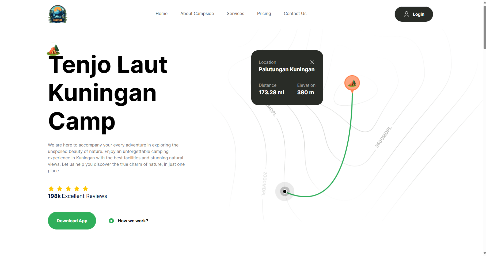
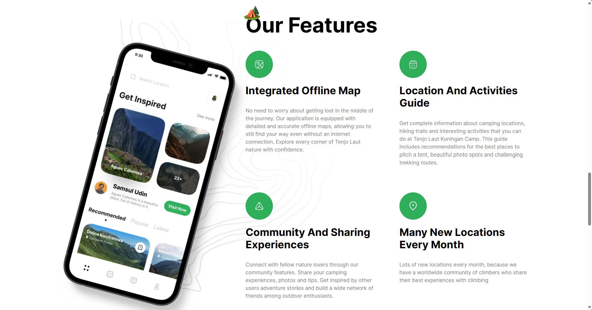
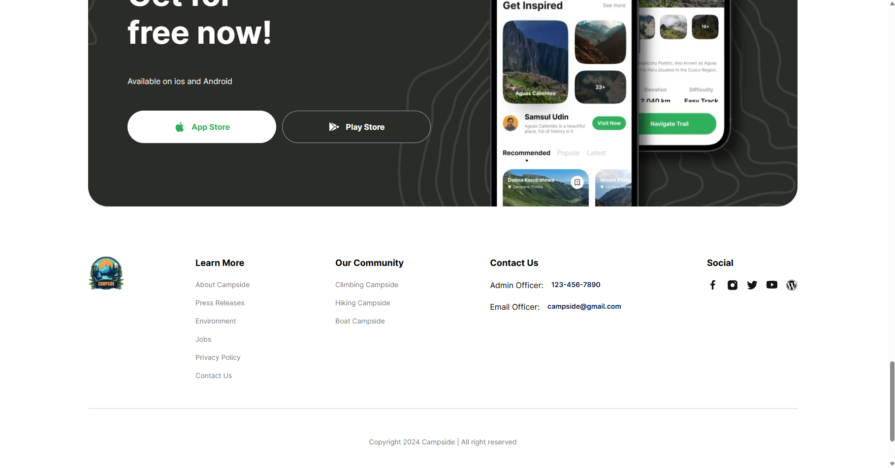

# Campside
Sebuah halaman utama website tentang promosi sebuah aplikasi seluler yang dimana agar user tertarik untuk mendownload aplikasinya dengan memperkenalkan manfaat dan fitur yang didapat dalam aplikasi ini

## Daftar Isi
- [Tumpukan Teknologi](#tumpukan-teknologi)
- [Bahasa Pemograman](#bahasa-pemograman)
- [Tampilan Website](#tampilan-website)
- [Beberapa Dokumentasi Halaman](#beberapa-dokumentasi-halaman)
- [Cara Instalasi](#cara-instalasi)

## Tumpukan Teknologi
### Frontend
- **ReactJS**: Perpustakaan UI untuk membangun antarmuka pengguna
- **Tailwind CSS**: Kerangka kerja CSS berbasis utilitas
- **Next.js**: Framework React yang powerful untuk pengembangan web yang efisien

### Bahasa Pemograman
- **TypeScript**: Bahasa pemrograman superset JavaScript yang kuat dengan dukungan statis dan linting yang kuat

## Tampilan Website
- **Navbar =** halaman navigasi untuk mengarahkan ke beberapa halaman dan untuk otentikasi pengguna
- **Hero =** halaman perkenalan aplikasi ke pengguna
- **Peta =** peta singkat untuk tujuan perkemahan
- **Galeri =** foto pemandangan perkemahan
- **Panduan =** panduan singkat ke tempat tujuan
- **Fitur =** beberapa fitur unggulan yang ditawarkan
- **Tawaran =** tawaran download aplikasi
- **Halaman Kaki =** beberapa informasi yang berguna untuk pengguna

## Beberapa Dokumentasi Halaman
##### 1. Halaman Awal


##### 2. Halaman Fitur


##### 3. Halaman Kaki


## Cara Instalasi
Instruksi langkah demi langkah untuk menginstal proyek Anda secara lokal.

```bash
# Clone repository ini
git clone https://github.com/defrijay/Majestic-Morsels-Restaurant.git

# Masuk ke direktori proyek
cd repository-name

# Instal dependensi
npm i --save-dev @types/node

# Jalankan server kodenya secara live
npm start --watch

# Buka url servernya
 http://localhost:3000
